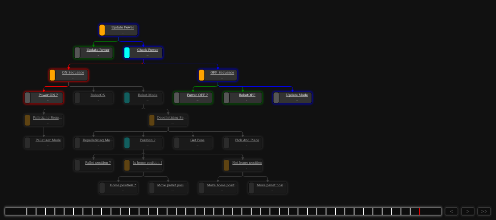

# Palletization Program Manager

Palletization program manager is a ROS 2 Humble node that utilize pytrees to do decision making for palletizer/depalletizer robot.

## Visuals
Current implementation of behaviour tree.


## Installation

The following steps asuume that ROS 2 Humble has been installed. If not please follow the official installation guide [here](https://docs.ros.org/en/humble/Installation/Ubuntu-Install-Debs.html).

NOTE: Ensure that all palletization package dependencies are installed !

1. Building the package and sourcing workspace.
```bash
cd ~/ros2_ws
colcon build
echo "source ~/ros2_ws/install/setup.bash" >> ~/.bashrc
```
2. Pytrees and pytrees ROS installation
```bash
pip install py-trees
sudo apt install \
    ros-humble-py-trees \
    ros-humble-py-trees-ros-interfaces \
    ros-humble-py-trees-ros
```
3. Pytrees viewer (OPTIONAL)
```bash
sudo apt-get install libqt5webengine5 libqt5webenginewidgets5 python3-pyqt5.qtwebengine

pip install pyqtwebengine

cd ~/ros2_ws/src/

git clone https://github.com/splintered-reality/py_trees_js.git 
git clone https://github.com/splintered-reality/py_trees_ros_viewer.git

cd ~/ros2_ws

colcon build
```

## Usage
1. Setup the connection between PC and UR Robot. Ensure that PC and UR Robot are on the same network (First 3 numbers must be the same). `Example: Robot IP: 192.168.11.100, PC IP: 192.168.11.1`
2. Launch UR Robot Driver. Steps to install UR Robot Driver is included in `Palletization Robot Description`
```bash
ros2 launch ur_robot_driver ur_control.launch.py ur_type:=ur10 robot_ip:=192.168.11.100 launch_rviz:=true description_package:=palletization_robot_description description_file:=test_robot.urdf.xacro
```
Replace `description_package` and `description_file` with your desired URDF.

3. Launch relavant palletization program.
```bash
ros2 launch palletization_vision_server launch.py 
```
etc.

4. Launch the program manager.
```bash
ros2 launch palletization_program_manager palletization_program_manager.launch.py 
```

5. View Pytrees during runtime.
```bash
py-trees-tree-viewer 
```
## Controlling the parameters
Currently there are 2 ROS parameters that can be set.
```bash
power: Turn ON/OFF the robot. (True/False)
mode: Robot mode. ('palletizing'/'depalletizing')
```

## Files
Brief explanation of existing files.

**`behaviours.py`**: Collections of behaviours to be used in pytrees.

**`palletization_program_manager.py`**: ROS 2 node currently just to setup the ROS2 parameters.

**`palletization_tree.py`**: This is where the structure of the tree is defined and run.


## Functions
1. Able to turn ON/OFF UR Robot and choose robot mode through ROS parameters.
2. Integrated `palletization_vision_server` for box detection and getting position of boxes of desired frame.

## What's Next ?
1. Integrate robot motion planning using MoveIt2.
2. Gripper control.
3. Palletizing sequences.

## Contact

Tey Yu Teng:
[yutengtey868@gmail.com](mailto:yutengtey868@gmail.com)
