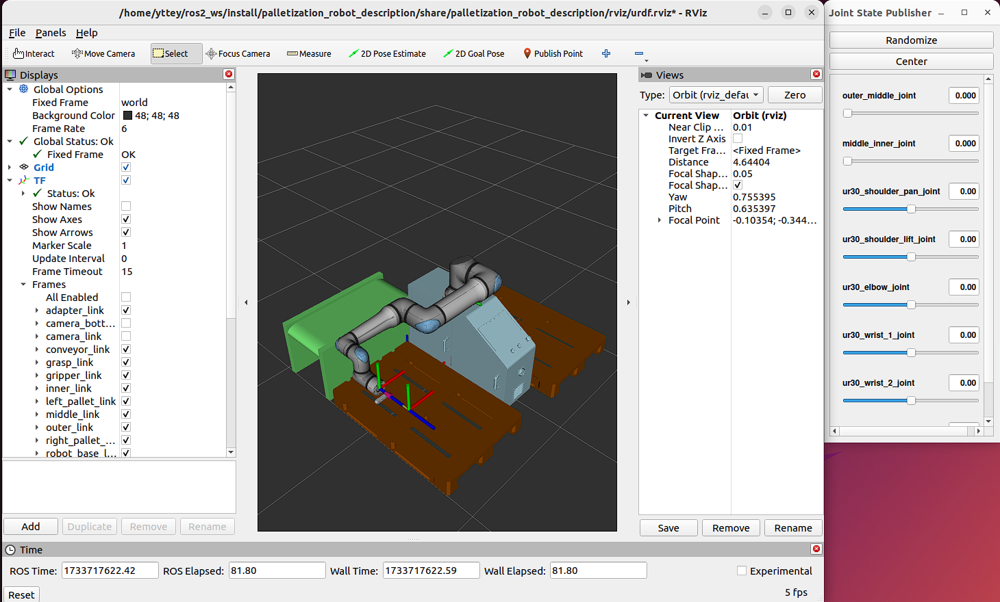

# Palletization robot description

Palletization robot description is a ROS 2 Humble package that contains the required robot model for visualization.

## Visuals


## Installation

The following steps asuume that ROS 2 Humble has been installed. If not please follow the official installation guide [here](https://docs.ros.org/en/humble/Installation/Ubuntu-Install-Debs.html).

1. Installing Universal Robot ROS2 Driver
```bash
sudo apt-get install ros-humble-ur
```

2. Installing ROS 2 Wrapper for Intel(R) RealSense(TM) Cameras
```bash
sudo apt install ros-humble-realsense2-*
```

## Usage
To launch the palletization robot model only:
```bash
ros2 launch palletization_robot_description palletization_robot.launch.py 
```
To launch the palletization robot model with the palletization vision server. Ensure that all of the palletization vision server dependencies are installed:
```bash
ros2 launch palletization_robot_description camera_robot.launch.py  
```

## Configuration
The robot configuration can be configured in `palletization_robot_description/config/palletization_robot.yaml`:
```bash
ur_type: UR Robot type
left_pallet: Spawn left pallet
right_pallet: Spawn right pallet
pallet_width: Pallet width (m)
pallet_length: Pallet length (m)
pallet_height: Pallet height (m)
pallet_distx: Pallet distance x measured from the center of the robot arm (m)
pallet_disty: Pallet distance y measured from the center of the robot arm (m)
conveyor: Spawn conveyor
conveyor_width: Conveyor width (m)
conveyor_length: Conveyor length (m)
conveyor_height: Conveyor height (m)
conveyor_distx: Distance x measured from the center of the robot arm (m)
conveyor_disty: Distance y measured from the center of the robot arm (m)
conveyor_angle: Angle of conveyor. (0 degrees: conveyor coming directly in front, 90 degrees(1.5708 rads): coming from left, -90 degrees(-1.5708 rads): coming from right
```
