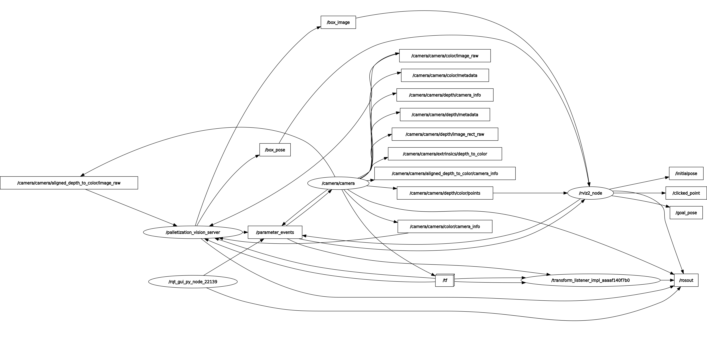
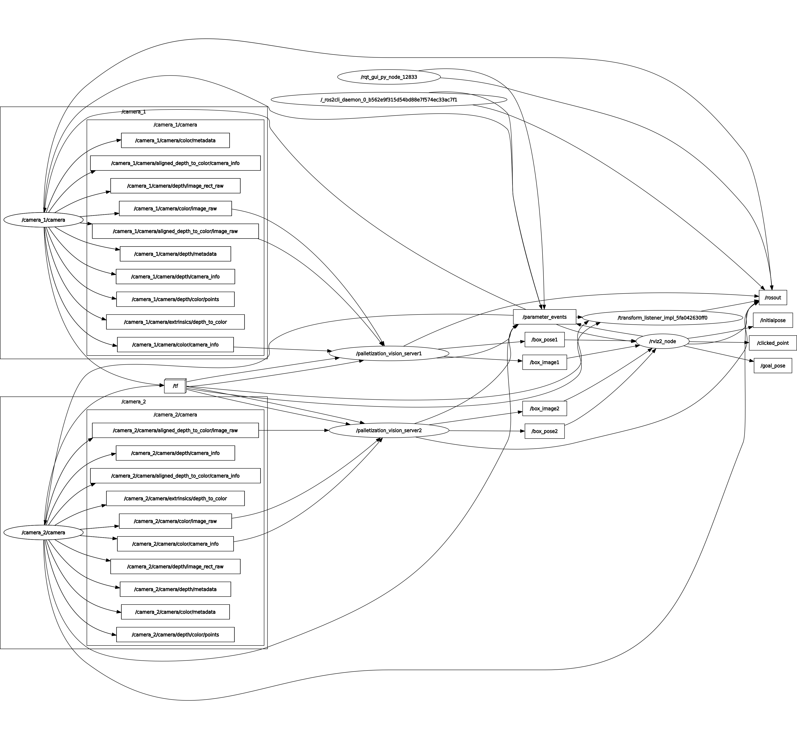
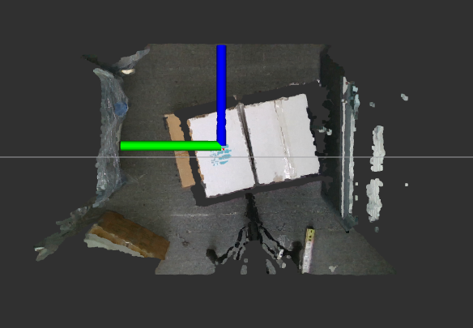
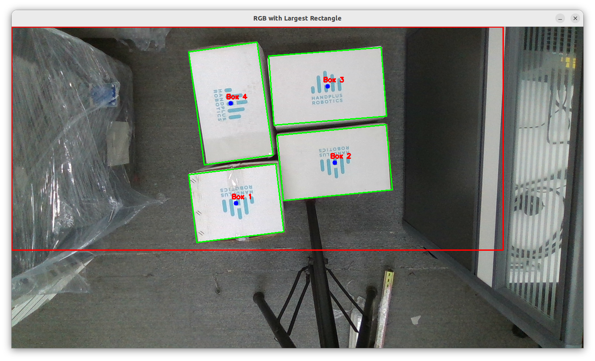

# Palletization Vision Server

The Palletization Vision Server is a ROS 2 Humble service designed for box detection and optimal pose estimation. When a request is made, the system processes the scene, detects boxes, and returns the most suitable box pose for palletization.

#### Key Features:
1. Box Detection: Utilizes OpenCV to identify and locate boxes within the scene.
2. Optimal Pose Calculation: Determines the best box pose for picking, based on priority (top-left, bottom-right etc)
3. ROS 2 Service Interface: Provides a structured request-response mechanism for retrieving box pose information.
## Content
### Understanding the system
The `rqt_graph` is a graphical visualization tool in ROS2 that displays the communcations between the nodes, topics, services and actions. 

To visualize the system, first launch the palletization vision server (refer to the section below). In a separate terminal, run:
```bash
ros2 run rqt_graph rqt_graph
```
This will generate a graph showing the connections between nodes and topics.

#### Identifying Publishers & Subscribers:
Nodes that publish to a topic are connected with arrows pointing out.
Nodes that subscribe to a topic have arrows pointing in.

If the graph does not update, click the refresh button in the top-left corner.

#### Debugging Missing Connections:
If a connection is not visible:
1. Check if the topic exists. Run: 
```bash
ros2 topic list
```
2. Inspect the publishers and subscribers to the node. Run: 
```bash
ros2 topic info /topic_name
```
3. Verify if data is being transmitted:
```bash
ros2 topic echo /topic_name
```

#### `rqt_graph` for single camera


#### `rqt_graph` for dual camera


### Visualisation (in RViz)
#### 1. `box_pose` and point cloud data


#### 2. `box_image` with annoted contours



## Installation
The following steps asuume that ROS 2 Humble has been installed. If not, please follow the official installation guide [here](https://docs.ros.org/en/humble/Installation/Ubuntu-Install-Debs.html).

1. Building the package and sourcing workspace.
```bash
cd ~/ros2_ws
colcon build
echo "source ~/ros2_ws/install/setup.bash" >> ~/.bashrc
```
2. Installing dependencies.\
Pyrealsense2 package
```bash
pip install pyrealsense2
```
Pyzbar library
```bash
pip install pyzbar
sudo apt-get install libzbar0
```
Go to home directory
```bash
cd ~
```
Register the server keys
```bash
sudo mkdir -p /etc/apt/keyrings
curl -sSf https://librealsense.intel.com/Debian/librealsense.pgp | sudo tee /etc/apt/keyrings/librealsense.pgp > /dev/null
```
Install a dependency
```bash
sudo apt-get install apt-transport-https
```
Add the server to the list of repositories
```bash
echo "deb [signed-by=/etc/apt/keyrings/librealsense.pgp] https://librealsense.intel.com/Debian/apt-repo `lsb_release -cs` main" | \
sudo tee /etc/apt/sources.list.d/librealsense.list
sudo apt-get update
```
Install the driver and utils
```bash
sudo apt-get install librealsense2-dkms librealsense2-utils
```
Install dependencies for ROS2 Humble
```bash
sudo apt install ros-humble-realsense2-*
```
TF transform
```
sudo apt install ros-humble-tf-transformations
```

## Usage 
Ensure the camera(s) are properly connected to the computer or host device.
In the virtual machine, navigate to the Device tab and verify that the checkbox for the camera(s) is selected.
Next, run realsense-viewer to confirm that the cameras are functioning correctly.
If the device does not appear in the Device tab or fails to launch, ensure that your computer has a USB 3.0 port.

### Single camera
1. Open a new terminal and run the following command to start the service node. 
```bash
ros2 launch palletization_vision_server single_cam_launch.py 
```

### Dual camera
The `dual_cam_launch.py` utilizes the API script `rs_multi_camera_launch` from the RealSense wrapper for ROS2 ([Link to script](https://github.com/IntelRealSense/realsense-ros/blob/ros2-development/realsense2_camera/launch/rs_multi_camera_launch.py)). Note that for all parameters, append the `camera_id` index at the back of parameter name. Configurable parameters are found in `rs_launch.py`. Use an index such as 1 and 2 to refer to cameras 'camera1' and 'camera2'.


1. Before running the launch file, ensure that `device_type` and `serial_no` match the connected cameras. With the cameras plugged in, run `rs-enumerate-devices` in the terminal. The RealSense devices should appear -- copy and paste the device type and serial number from the terminal and replace the existing values in `dual_cam_launch.py`.

**Note:** serial_no includes a leading underscore ( _ ). For example, "123456789" is represented as "_123456789".

2. Open a new terminal and run the following command to start the service node
```bash
ros2 launch palletization_vision_server dual_cam_launch.py 
```

### Trigger callback
3. Once the server is running, run the following command in the new terminal to call the `get_pose` service for camera 1:
```bash
ros2 service call /get_pose1 palletization_vision_interface/srv/GetPoses {}
```

**Note:** The service name is `get_pose{camera_id}`. For `single_cam_launch`, `camera_id` is initialized as 1.

4. If using `dual_cam_launch`, run the following command to call the service for camera 2:

```bash
ros2 service call /get_pose2 palletization_vision_interface/srv/GetPoses {}
```

5. The service should return an output similar to what is shown below:
```bash
response:
palletization_vision_interface.srv.GetPoses_Response(success=False, message='bottomright box detected at: x=0.15098872780799866, y=-0.042018454521894455,z=0.7730000019073486 with box ID 1. \n All poses: [[0.15098872780799866, -0.042018454521894455, 0.7730000019073486, 0, 0, 0.6508771696266111, 1]]', source_coord=[palletization_vision_interface.msg.BoxPose(x=0.15098872780799866, y=-0.042018454521894455, z=0.7730000019073486, rx=0.0, ry=0.0, rz=0.6508771696266111, box_id=1)], target_coord=[], optimal_target=palletization_vision_interface.msg.BoxPose(x=0.0, y=0.0, z=0.0, rx=0.0, ry=0.0, rz=0.0, box_id=0))\
```
**Note:** The response field has the following data:

```bash
bool success # Return True only if detected boxes are transformed into target frame coordinates
string message # Info regarding the optimal pose of box w.r.t camera frame
BoxPose[] source_coord # List of all detected box poses w.r.t camera frame
BoxPose[] target_coord # List of all detected box poses w.r.t target frame
BoxPose optimal_target # The optimal pose
```


### Adjusting the parameters
Under the `palletization_vision_server/config` there is a file named 'vision_param.yaml' which can be use to control the parameters. Vision model parameters can also be adjusted below in the same file.
```bash
average: Perform average of past frames or use last frame. Using the average is recommended to ensure accuracy in pose calculation when working with OpenCV.
cameraDirection: Camera direction pointing directly down (x/y/z)
frames: Number of previous arrays of box poses to consider
width: Width of the box in meters (longer side)
height: Height of the box in meters (shorter side)
priority: Select where to start picking boxes from (i.e. topright, topleft, etc.)
roi: Region of interest bounding box (xCoord, yCoord, width, height)
topic: Topic to determine reference frame
targetFrame: Target frame to transform
useDepthFiltering: Use depth image with canny edge
palletCamDist: Distance between pallet and camera scanning distance in metres (m)
binDetection: Bin or box detection
```
## Features
1. Utilizes OpenCV library for box detection.
2. Utilizes PointCloud data from Intel Realsense camera to do transformation based on chosen target frame.
3. Computes optimal box pose from detected list of box.
4. Annotated image with bounding box can be viewed under topic `/box_image{camera_id}`.
5. Detects barcode on the box.
6. Bin detection included

## Limitations
1. Dark colors such as black affects the depth data.
2. Setup of the camera is very important. This program runs under the assumption the boxes are directly below the camera.

## Contact
Chie Weng:
[chiekencoop@gmail.com](mailto:chiekencoop@gmail.com)
